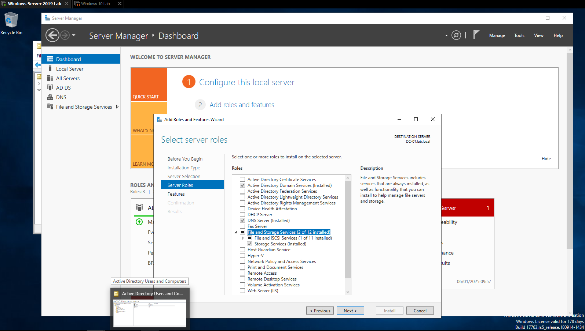
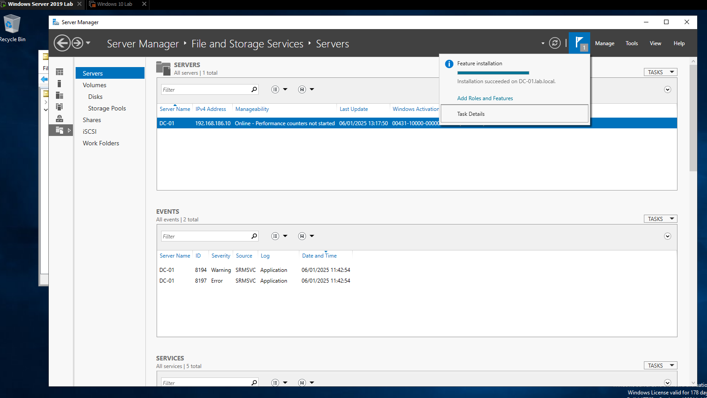
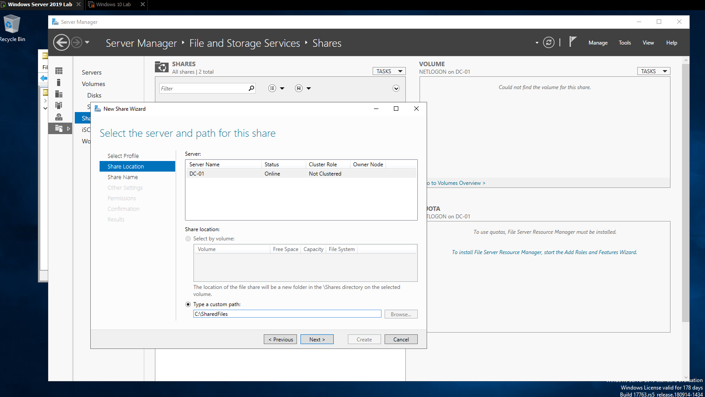
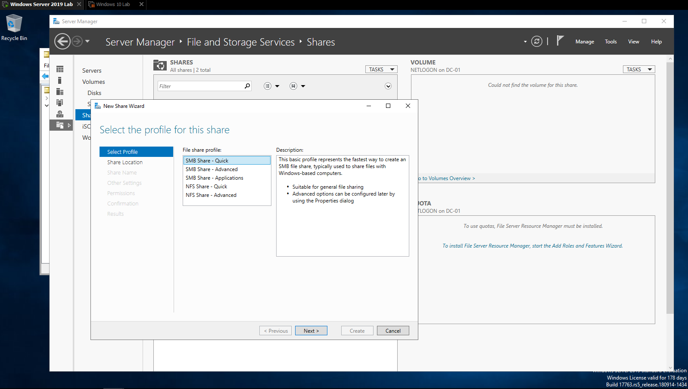
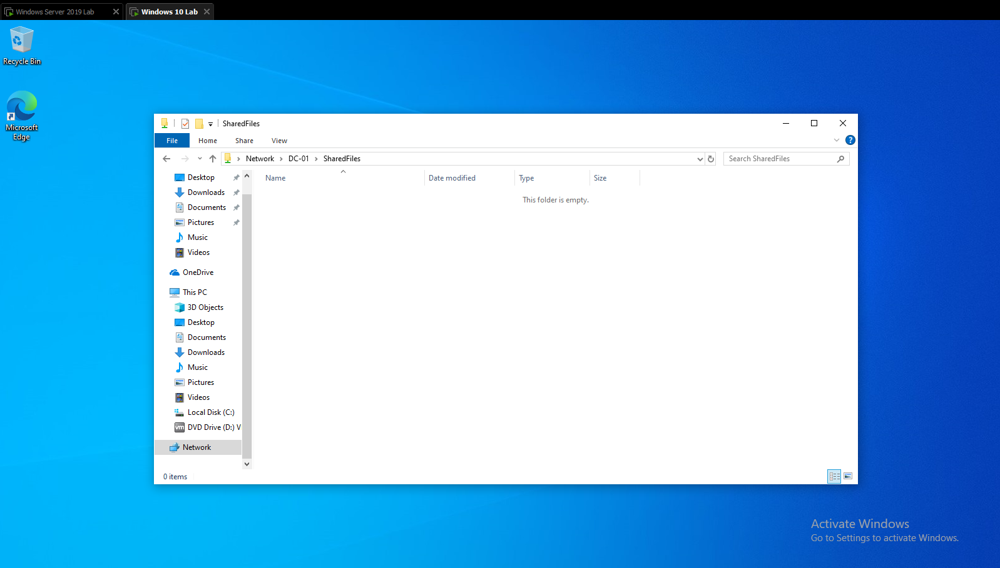
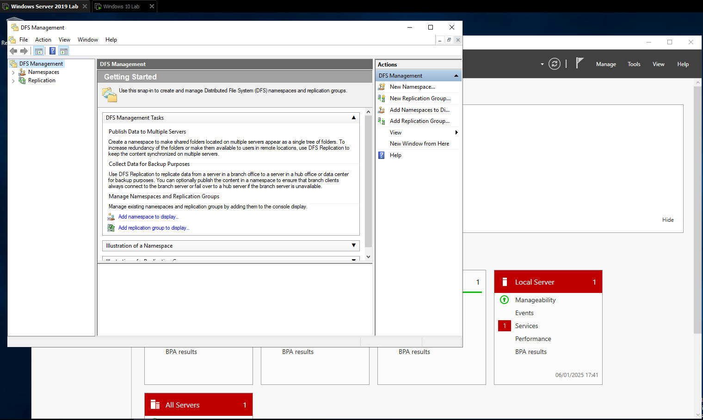
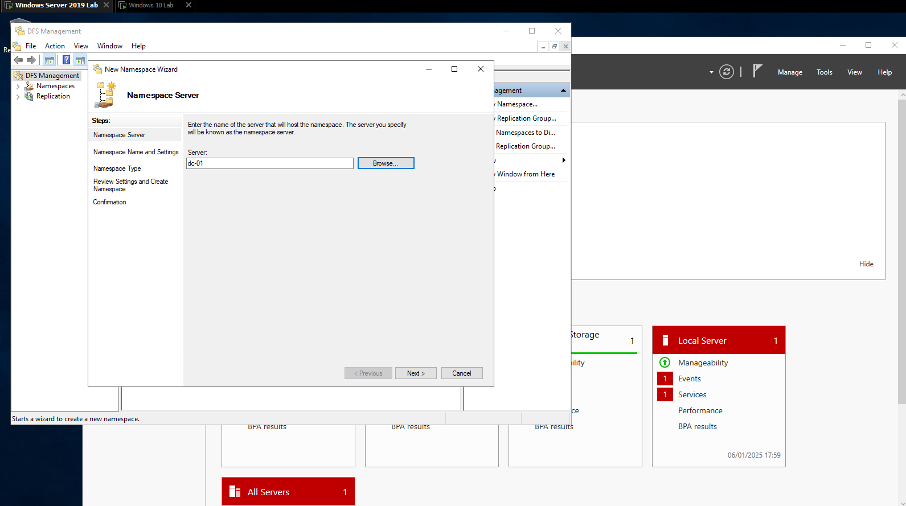
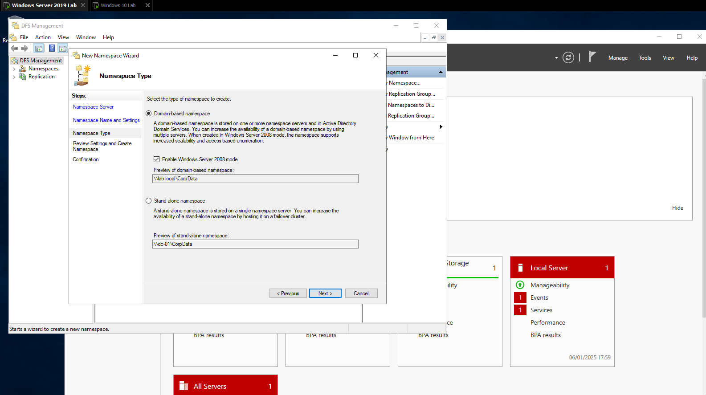
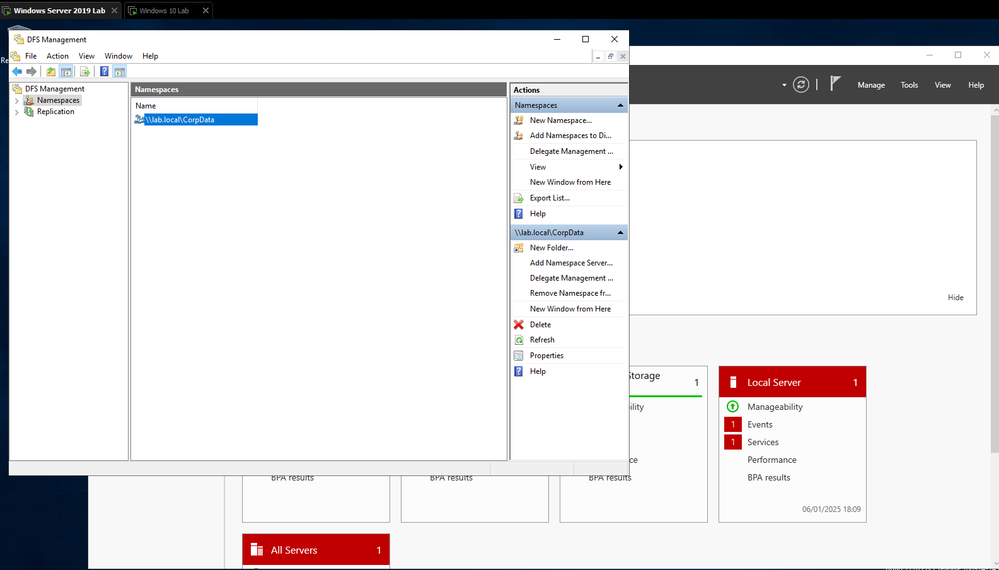
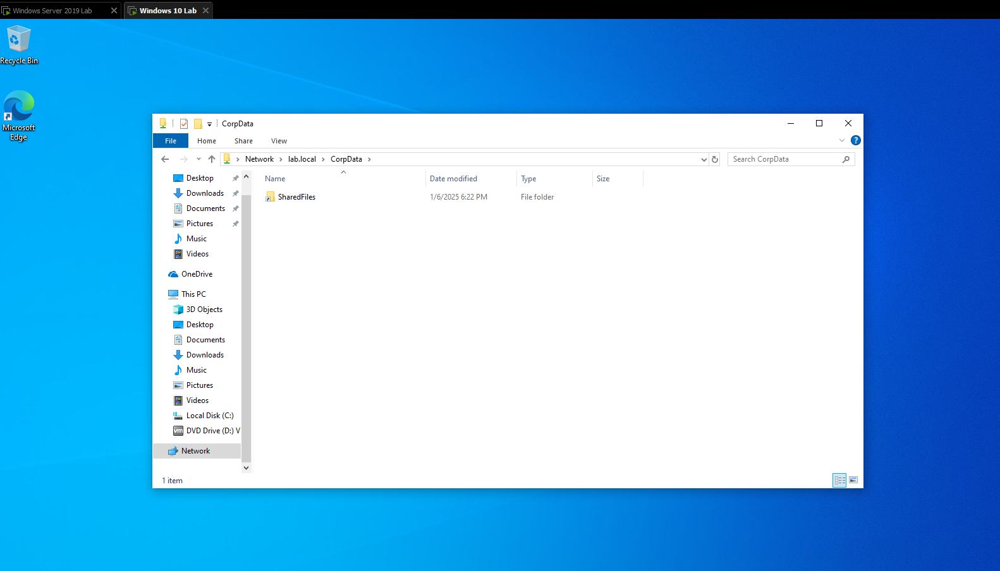

# WinServer File Server and DFS Lab
---
**A Hands-on Lab for Configuring File Server and Distributed File System (DFS) in Windows Server**
---

This project demonstrates the configuration of a File Server and Distributed File System (DFS) in a Windows Server environment, including creating shared folders, setting up namespaces, and validating the setup from a client machine.

---

## Table of Contents
1. [Project Objectives](#project-objectives)
2. [Steps Implemented](#steps-implemented)
    - [1. File Server Role Setup](#1-file-server-role-setup)
    - [2. Configuring Shared Folders](#2-configuring-shared-folders)
    - [3. Setting Up DFS Namespace](#3-setting-up-dfs-namespace)
    - [4. Testing and Validation](#4-testing-and-validation)
3. [Screenshots](#screenshots)
4. [Tools Used](#tools-used)
5. [Troubleshooting](#troubleshooting)
6. [Useful Links](#useful-links)
7. [License](#license)
8. [Contributions](#contributions)

---

## Project Objectives

This lab equips you with the skills to manage centralized storage and improve accessibility in enterprise environments using File Server and DFS technologies.

- **Install the File Server Role:**  
  Deploy the "File and Storage Services" role on Windows Server to enable the management of shared folders and centralized file storage. This role serves as the foundation for providing seamless access to resources within a networked environment.

- **Set Up Shared Folders:**  
  Create and configure shared folders to centralize file access for network users. This involves defining folder paths, applying appropriate permissions, and ensuring compatibility with SMB (Server Message Block) protocol for secure and efficient file sharing.

- **Configure DFS Namespace:**  
  Establish a Distributed File System (DFS) Namespace to organize multiple shared folders into a unified logical structure. This approach simplifies navigation for users, improves accessibility, and allows administrators to abstract physical file locations.

- **Validation and Testing:**  
  Perform thorough testing to ensure the shared folders and DFS namespace are accessible and functional. This includes validating network paths, permissions, and client-server connectivity to guarantee a seamless user experience.


---

## Steps Implemented

### 1. File Server Role Setup

1. **Install File Server Role:**  
   The "File and Storage Services" role is critical for centralizing file storage and managing network shares efficiently.  
   - **Steps to Perform:**  
     - Open **Server Manager > Add Roles and Features**.  
     - Select **File and Storage Services** under **Server Roles**.  
     - Review the features included, such as **SMB Protocol Support**, and click **Next** until you reach the confirmation page.  
     - Click **Install** to proceed with the installation.  
     - Wait for the installation progress to complete, which can be monitored in the Server Manager dashboard.  

       
     *This screenshot shows the selection of the File Server role.*  

   - **Why This Step Is Important:**  
     This role enables the server to host shared folders accessible over the network, which is foundational for both centralized storage and DFS.

   - **Common Pitfalls:**  
     - Ensure the server has sufficient disk space for the shared folders.  
     - If the role installation fails, check the server's network connectivity and domain membership.

2. **Complete Role Installation:**  
   After the installation, verify that the role is functioning by accessing **File and Storage Services > Shares** in Server Manager. This ensures the server is ready for shared folder creation.  

     
   *This screenshot confirms the successful installation of the File Server role.*


---

### 2. Configuring Shared Folders

1. **Create a New Shared Folder:**  
   Shared folders are essential for centralized file access, allowing users across the network to store and retrieve files efficiently.  
   - **Steps to Perform:**  
     - Navigate to **Server Manager > File and Storage Services > Shares**.  
     - Click **Tasks > New Share** to open the New Share Wizard.  
     - Choose the **Custom Path** option and specify the folder path as `C:\SharedFiles`.  
       > **Tip:** Ensure the directory `C:\SharedFiles` exists on the server. If not, create it before proceeding.  
     - Click **Next** to review and proceed with the folder setup.  

       
     *This screenshot shows the folder path being selected for sharing.*

   - **Why This Step Is Important:**  
     Defining a shared folder enables the File Server role to provide centralized storage that is accessible to clients on the network.

   - **Common Pitfalls:**  
     - Ensure the server has sufficient disk space to host the shared folder.  
     - Verify that the `C:\SharedFiles` directory has the correct NTFS permissions to allow sharing.  

---

2. **Set SMB Share Profile:**  
   The SMB protocol is widely used for network file sharing in Windows environments. Configuring the correct profile ensures proper access control and performance.  
   - **Steps to Perform:**  
     - Select the **SMB Share - Quick** profile. This profile is ideal for general file sharing with default options.  
       > **Note:** For more advanced configurations, such as specific user-based permissions or quotas, the **SMB Share - Advanced** profile can be used.  
     - Enable permissions inheritance to allow subfolders and files to inherit parent folder permissions.  
     - Configure offline access if needed (e.g., enabling "Only the files users open" for caching).  
     - Click **Create** to finalize the shared folder setup.  

       
     *The screenshot illustrates the selection of the SMB Share - Quick profile.*

   - **Why This Step Is Important:**  
     The SMB Share profile defines how the shared folder behaves on the network and manages user permissions and access.

   - **Common Pitfalls:**  
     - Ensure the correct user groups or accounts are granted appropriate permissions (e.g., Read, Write).  
     - If offline access is enabled, ensure caching settings align with organizational needs.  

---

3. **Verify Shared Folder Access:**  
   Validating shared folder access ensures the configuration is functional and accessible to users.  
   - **Steps to Perform:**  
     - On a client machine, open **File Explorer** and navigate to the network path `\\DC-01\SharedFiles`.  
       > **Tip:** Replace `DC-01` with the hostname or IP address of your server if DNS is not configured.  
     - Verify that the folder opens without errors and that files can be added, edited, or removed based on assigned permissions.  

       
     *This screenshot confirms successful access to the shared folder from the client machine.*

   - **Why This Step Is Important:**  
     Testing ensures the shared folder is functional and accessible over the network, validating that permissions and connectivity are properly configured.

   - **Common Pitfalls:**  
     - If the shared folder is not accessible, verify network connectivity between the client and server.  
     - Ensure the Windows Firewall on the server is not blocking SMB traffic. Enable the **File and Printer Sharing** exception if needed.  
     - Confirm that the client machine is part of the same domain or workgroup as the server.


---

### 3. Setting Up DFS Namespace

1. **Open DFS Management:**  
   DFS (Distributed File System) simplifies the organization and access of shared folders by consolidating them into a logical namespace.  
   - **Steps to Perform:**  
     - Open **DFS Management** from the Start Menu or via **Server Manager > Tools > DFS Management**.  
     - In the DFS Management Console, navigate to the **Namespaces** section to begin the configuration.  
       > **Tip:** Ensure that the File Server role is properly installed and the server is part of the Active Directory domain before proceeding.

       
     *The screenshot displays the DFS Management Console ready for configuration.*

   - **Why This Step Is Important:**  
     Accessing the DFS Management Console is the first step to creating a centralized namespace for shared folders, enabling simplified navigation for users.

   - **Common Pitfalls:**  
     - If the DFS Management tool is missing, verify that the **DFS Namespaces** feature is installed.  
     - Ensure the server has connectivity to the domain controller if configuring a domain-based namespace.

---

2. **Create a New Namespace:**  
   A namespace acts as a unified logical structure to organize shared folders.  
   - **Steps to Perform:**  
     - In the **Actions** pane, click **New Namespace** to launch the wizard.  
     - Select the server `DC-01` to host the namespace and click **Next**.  
     - Enter the namespace name as `CorpData`. This name will appear in the UNC path (e.g., `\\lab.local\CorpData`).  
     - Choose **Domain-Based Namespace** for scalability and integration with Active Directory.  
       > **Note:** Domain-based namespaces are preferred in enterprise environments as they allow for fault tolerance and easier management.  
     - Click **Next** and then **Create** to finalize the setup.  

       
     *The screenshot shows the selection of the server `DC-01` as the namespace host.*  

       
     *This screenshot illustrates the configuration of a domain-based namespace.*

   - **Why This Step Is Important:**  
     A domain-based namespace centralizes shared folder access and provides fault tolerance when combined with DFS Replication.

   - **Common Pitfalls:**  
     - Ensure the namespace name does not conflict with existing names in the domain.  
     - Verify that the Active Directory Domain Services are running and accessible.

---

3. **Add Shared Folder to Namespace:**  
   Linking the shared folder to the namespace makes it accessible through the logical structure.  
   - **Steps to Perform:**  
     - In DFS Management, select the newly created namespace `\\lab.local\CorpData`.  
     - Right-click and select **New Folder** to add a shared folder to the namespace.  
     - Provide a folder name (e.g., `SharedFiles`) and link it to the shared folder path `\\DC-01\SharedFiles`.  
     - Click **OK** to save the configuration.  

       
     *This screenshot demonstrates the addition of the shared folder to the DFS namespace.*

   - **Why This Step Is Important:**  
     Adding shared folders to the namespace provides a seamless and logical path for users to access network resources.

   - **Common Pitfalls:**  
     - Ensure the shared folder path is correct and accessible from the DFS namespace server.  
     - Verify that the shared folder permissions align with organizational access requirements.

---

4. **Verify Namespace Access:**  
   Testing access ensures that the namespace and linked folders are functional.  
   - **Steps to Perform:**  
     - On a client machine, open **File Explorer** and navigate to the namespace path `\\lab.local\CorpData`.  
       > **Tip:** If the namespace is not accessible, try pinging the domain or checking the Active Directory replication status.  
     - Confirm that the linked folder (`SharedFiles`) is visible and accessible within the namespace.  

       
     *This screenshot validates successful access to the DFS namespace.*

   - **Why This Step Is Important:**  
     Validating access confirms that the namespace is properly configured and the shared folders are accessible via the logical path.

   - **Common Pitfalls:**  
     - If the namespace is not accessible, check the DFS Namespace service status on the server.  
     - Ensure the client machine is properly joined to the domain and can resolve DNS names.


---

### 4. Testing and Validation

Testing is a critical step to ensure that the shared folder and DFS namespace configurations are functional and accessible to users. This process validates network connectivity, permissions, and overall system reliability.

---

1. **Verify Shared Folder Access:**  
   The shared folder must be directly accessible from the client machine to confirm the File Server role and SMB share configuration are working as intended.  
   - **Steps to Perform:**  
     - On the client machine, open **File Explorer**.  
     - In the address bar, enter the network path:  
       ```plaintext
       \\DC-01\SharedFiles
       ```  
       > **Tip:** Replace `DC-01` with the server's hostname or IP address if DNS resolution is unavailable.  
     - Attempt to open the folder and test file operations, such as creating, editing, or deleting a test file.  

       
     *This screenshot confirms direct access to the shared folder from the client machine.*

   - **Why This Step Is Important:**  
     Validating direct access to the shared folder ensures that SMB sharing is correctly configured and functional, which is essential before integrating it into the DFS namespace.

   - **Common Pitfalls:**  
     - If access is denied, verify the NTFS and share permissions for the folder.  
     - Ensure the firewall on the server allows SMB traffic (e.g., **File and Printer Sharing** is enabled).  
     - Confirm that the client machine is on the same network or can route to the server.

---

2. **Validate DFS Namespace Access:**  
   Testing the DFS namespace ensures that the logical path (namespace) is correctly configured and accessible, providing a seamless user experience.  
   - **Steps to Perform:**  
     - On the client machine, open **File Explorer**.  
     - In the address bar, enter the DFS namespace path:  
       ```plaintext
       \\lab.local\CorpData
       ```  
       > **Tip:** Replace `lab.local` with your domain name if different.  
     - Verify that the shared folder (`SharedFiles`) is visible under the namespace.  
     - Test file operations within the namespace to confirm full functionality.  

       
     *This screenshot demonstrates successful access to the DFS namespace and linked shared folder.*

   - **Why This Step Is Important:**  
     Validating the DFS namespace ensures that users can access shared resources through a centralized and logical structure, regardless of the folder's physical location.

   - **Common Pitfalls:**  
     - If the namespace is inaccessible, check that the DFS Namespace service is running on the server.  
     - Verify DNS resolution for the domain name (e.g., `lab.local`) from the client machine.  
     - Ensure the client is properly authenticated with the domain and has permissions to access the namespace.  

---

### Additional Recommendations:
- **Advanced Testing:**  
  - Test access from multiple client machines to ensure consistency.  
  - Simulate scenarios like a client machine in a different subnet to validate cross-network connectivity.  

- **Monitoring Tools:**  
  - Use tools like `net use` on the client machine to map and verify network shares and namespaces:  
    ```powershell
    net use \\lab.local\CorpData
    ```
  - Use **Event Viewer** on the server to check for errors or warnings related to DFS or SMB traffic.


---

## Screenshots

### 1. **File Server Role Installation**
- **Description:** These screenshots show the process of selecting and installing the File Server role, which is essential for managing shared folders and providing centralized file storage.

     
   *Selecting the File Server role in the Server Manager during the role installation process.*

     
   *The confirmation screen after the successful installation of the File Server role.*

---

### 2. **Shared Folder Configuration**
- **Description:** These screenshots illustrate the steps to create and configure a shared folder using the New Share Wizard in Server Manager.

     
   *Choosing the folder path `C:\SharedFiles` to be shared.*

     
   *Selecting the SMB Share - Quick profile, which provides a simple and efficient way to configure shared folders.*

---

### 3. **DFS Namespace Configuration**
- **Description:** These screenshots demonstrate the setup of a DFS namespace and the addition of a shared folder to the namespace.

     
   *Opening the DFS Management Console to configure the namespace.*

     
   *Selecting the server `DC-01` to host the namespace during the New Namespace Wizard setup.*

     
   *Configuring the namespace as Domain-Based, which provides better scalability and integration with Active Directory.*

     
   *Adding the shared folder `SharedFiles` to the namespace `\\lab.local\CorpData`.*

---

### 4. **Validation**
- **Description:** These screenshots confirm the functionality of the shared folder and DFS namespace by testing access from a client machine.

     
   *Verifying direct access to the shared folder using the network path `\\DC-01\SharedFiles`.*

     
   *Testing access to the DFS namespace and its linked shared folder using the logical path `\\lab.local\CorpData`.*


---

## Tools Used

- **Windows Server 2019**  
- **Windows 10 Pro**  
- **VMware Workstation Pro**  
- **PowerShell and CMD**

---

## Troubleshooting

### Shared Folder Not Accessible  
- **Resolution:** Verify share permissions and ensure the folder is accessible from the network.

### DFS Namespace Not Accessible  
- **Resolution:** Check DFS namespace settings and ensure the shared folders are correctly linked.

---

## Useful Links

- [Microsoft File Server Documentation](https://learn.microsoft.com/en-us/windows-server/storage/file-server)  
- [Distributed File System Documentation](https://learn.microsoft.com/en-us/windows-server/storage/dfs-namespaces/dfs-overview)  

---

## License

Licensed under the [MIT License](./LICENSE).

---

## Contributions

Feel free to contribute to this project via pull requests or issues.
